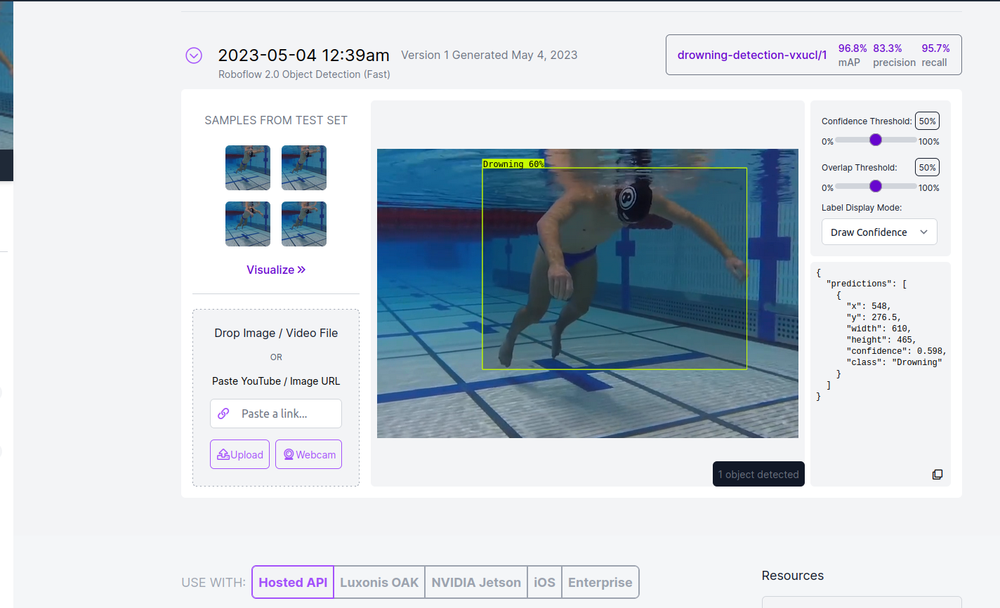
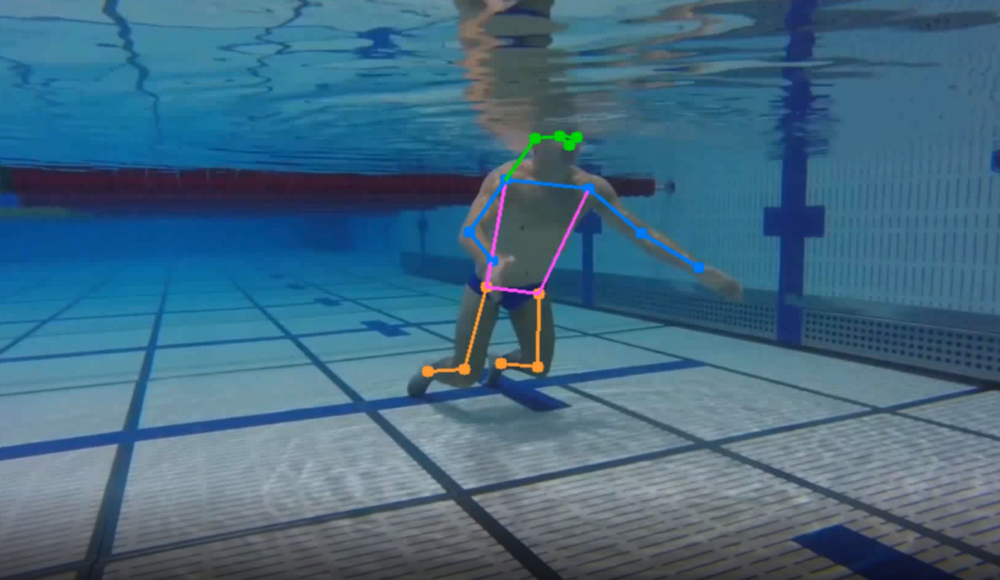
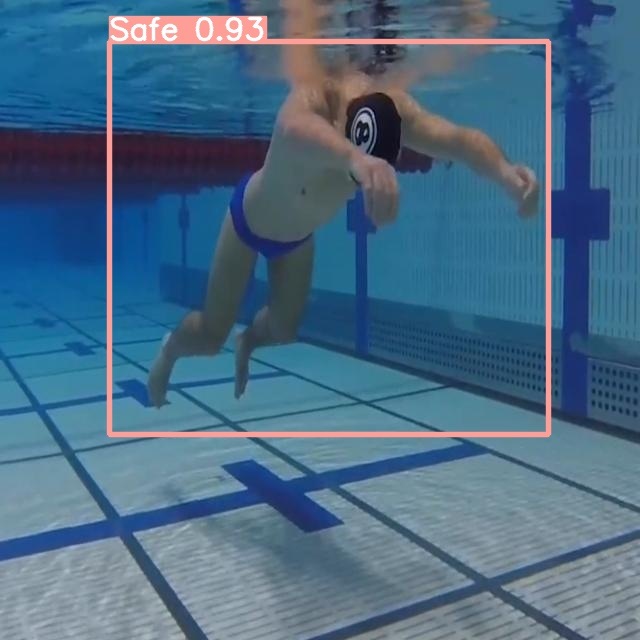
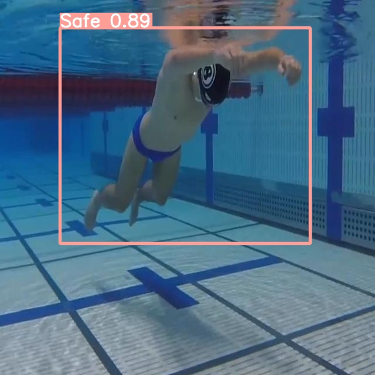
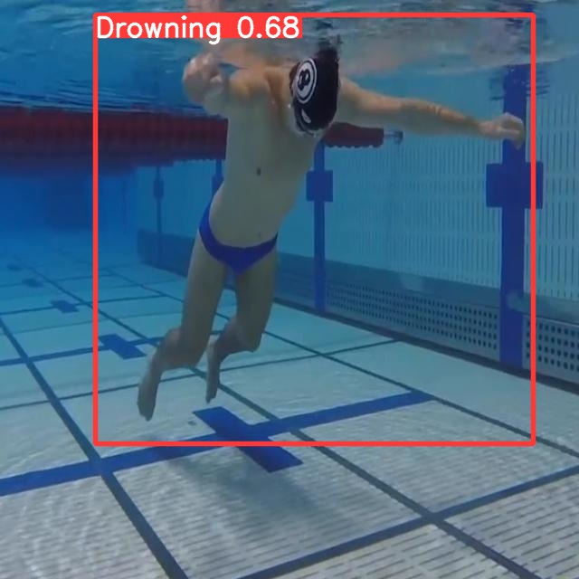
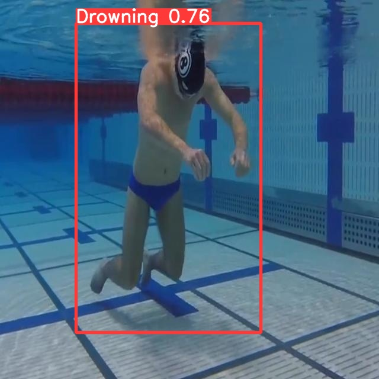
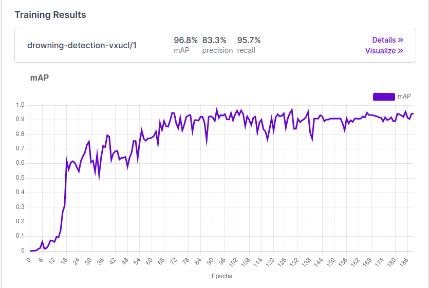
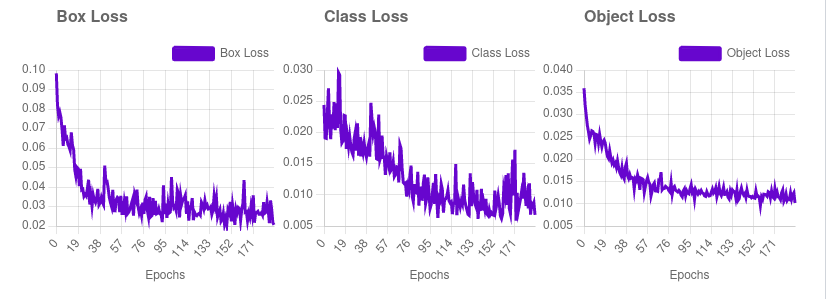

# Drowning_Detection

A Complex Drowning detection system that uses YOLOV7 & YOLOV8 to detect whether a user in a video is drowning or not. 

## Introduction

## YOLOV7 - PoseNet Detection

## YOLOV8 - Drowning Estimation

## Results

## Testing the App
* Roboflow : https://app.roboflow.com/franklines-space-ywbil/drowning-detection-vxucl/deploy/1
## Conclusion

*This project is still very limited to the Dataset I was provided inform of a video hence its overfitted

## Further Improvements
* Robust Dataset
